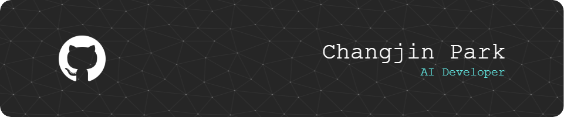

# 안녕하세요, 박창진입니다 👋  
 

**AI와 사람 사이의 연결점**,  
기술과 감성을 함께 고민하는 예비 개발자입니다.  
저는 데이터를 기반으로 실제 문제를 해결하고,  
사용자 경험(UX)과 연결된 기술적 접근에 관심이 많습니다.  
 
최근에는 AI-agent 구조, 객체지향 설계, 소프트웨어 기획 등을 중심으로 공부하고 있으며,  
작은 아이디어도 실행 가능한 프로토타입으로 구현해보고자 노력하고 있어요.  
  

---

## 👨‍💻 Who I Am  
 

- 사람의 감정을 이해하고 연결하는 기술을 꿈꿉니다  
- AI 에이전트 / UX 기반 서비스 / 심리적 자동화 시스템에 관심  
- 문제를 코드로 풀어내는 데에서 의미를 찾고 있습니다  
  

---

## 🏫 Background  
 

🎓 **금융정보공학 전공**  
데이터 기반의 문제 해결과 수치 분석을 배우며,  
정보 구조와 시스템 사고에 익숙해졌습니다.  
 

🎨 **패션 업계 실무 경험**  
오랜 시간 창의성과 감각이 요구되는 환경에서  
사람의 흐름, 트렌드, 경험 중심 사고를 익혔습니다.  
 

💡 **지금은 기술과 감성을 연결하는 길 위에 있습니다**  
패션에서 얻은 ‘감각’, 금융에서 익힌 ‘분석’,  
그리고 기술로 구현하는 ‘구조’를 하나로 엮어  
사람 중심의 AI 서비스를 설계하고자 합니다.
  

---

## 🛠 사용 언어 및 도구  
 

|  | [Python 학습 내용](https://github.com/jini-c/HighTech-AI-Software/tree/main/01%20Python) |

  
  

---

## 🚀 Projects  
 

### 🧠 AI-Agent 기반 재활용 쓰레기 자동 분류 시스템  
> 한이음 드림업 프로젝트 (2025년 4월 ~ 11월)  
- 강화학습 및 이미지 분류 기반 스마트 분리수거 시스템 설계  
- 사용자 행동 예측을 통한 피드백 시스템 적용  
 

### 💼 미래 내일 일경험 프로그램  
> 2025년 6월 ~ 8월 예정  
- 실제 기업 현장에서 소프트웨어 기획 및 협업 경험 예정  
 

### 📊 데이터 분석 기반 개인 프로젝트  
> 2025년 진행 예정  
- 관심 분야 데이터 수집 및 인사이트 도출  
- Pandas, Matplotlib, scikit-learn 중심 실습 프로젝트 예정  
  

### 🎬 영상 + 트렌드 분석 기반 개인 프로젝트
> 2025년 진행 예정
- 런웨이/영상 기반 트렌드 문장 수집 및 분석
- 사용자 키워드 입력 기반 실시간 트렌드 예측 로직 구현
- Python을 중심으로 간단한 웹 시각화 및 기능 확장 계획
  

### 🛠 추가 소규모 개인 프로젝트 기획 중
> 2025년 이후 틈틈이 진행 예정
- 학습한 기술을 응용해 작고 가벼운 기능 중심 프로젝트를 간헐적으로 시도할 계획
- 완성도보다는 실험과 구현 연습 중심으로 접근할 계획
  

---

## 📌 Currently Focusing On  
 

- Java와 객체지향 프로그래밍  
- Python 기반 데이터 분석 프로젝트 설계  
- GitHub 중심 포트폴리오 정리  
- UX 기반 AI 서비스 구상  
  

---

## 🎓 Certificates & Education  
 

> 현재 준비 중인 자격증입니다.

- ⛏️ 정보처리기능사 *(2025.08 ~ 11)*  
- ⛏️ 빅데이터분석기사 *(2025.08 ~ 11)*  
- ⛏️ ADSP *(2025.08 ~ 09)*  
- ⛏️ 영어 자격증 *(OPIC or TOEIC SPEAKING)*  
  

---

## 📊 Top Languages  
 

  
  

---

## 📫 Contact  
 

📧 Email: pwh1011@naver.com  
🌐 GitHub: [jini-c](https://github.com/jini-c)  
📚 Tech Blog (Coming Soon): https://changjin.dev  
📖 Tistory (Personal Journal): https://jini-c.tistory.com
 

> "기술은 사람을 위한 따뜻한 언어가 될 수 있다고 믿습니다."

