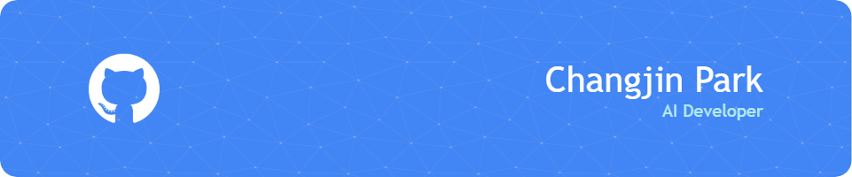

# 👋 안녕하세요, 박창진입니다.

🎯 패션 업계의 제작 경험을 바탕으로  
현재는 **AI, Python, 소프트웨어 개발**을 배우며  
기술과 감성이 만나는 지점을 탐구하고 있습니다.

---

## 🛠 사용 언어 및 도구

---

## ✨ 가치관

> “기술은 사람의 감정과 흐름을 이해하고 연결하는 도구라고 믿습니다.”  
> **AI 에이전트, 심리 기반 자동화 서비스**에 깊은 관심을 갖고 있습니다.

---

## 📊 GitHub 활동 통계

---

📫 **Contact**: 준비 중...
